# Журнал разработки

---

## Состояние проекта на момент начало работы

На начало этого весеннего семестра проект уже имел ранний билд, сделанный предшествующей группой студентов, состоящей преимущественно из старших курсов из-за чего команда позже сильно изменилась. 

На тот момент Forest ranger представлял из себя **point-and-click** на тему егерьства с тремя основными локациями.  Геймплей являлся сборником мини-игр объединённых сюжетными событиями, на первой локации такое событие из себя представляет сдача экзамена на егеря.

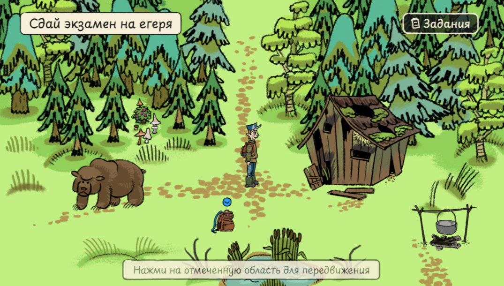

---

## Переработка проекта

В процессе работы было принято общее решение о необходимости полной переработки изначального концепта, включая жанровую принадлежность, сюжет и дизайн.

<u>Переработка состояла из следующих этапов:</u>

- Поиск идей и референсов

- Создание артбука с концептами и единой стилистикой

- Разработка раннего билда

### Поиск идей и референсов

На момент, когда появилось понимание о том, что работать с Forest Ranger в том состоянии, в котором он был, нерационально, первым делом встал вопрос об дальнейшей идентичности проекта: **"Как изменить его так, чтобы вовлечь основную целевую аудиторию в игровой процесс?"**

Было уделено немало времени и совместных усилий на брейнштормы, поиск подходящего жанра и визуала, подбор как уже существующих в геймдеве игр, так и реальных заповедников в качестве референсов.

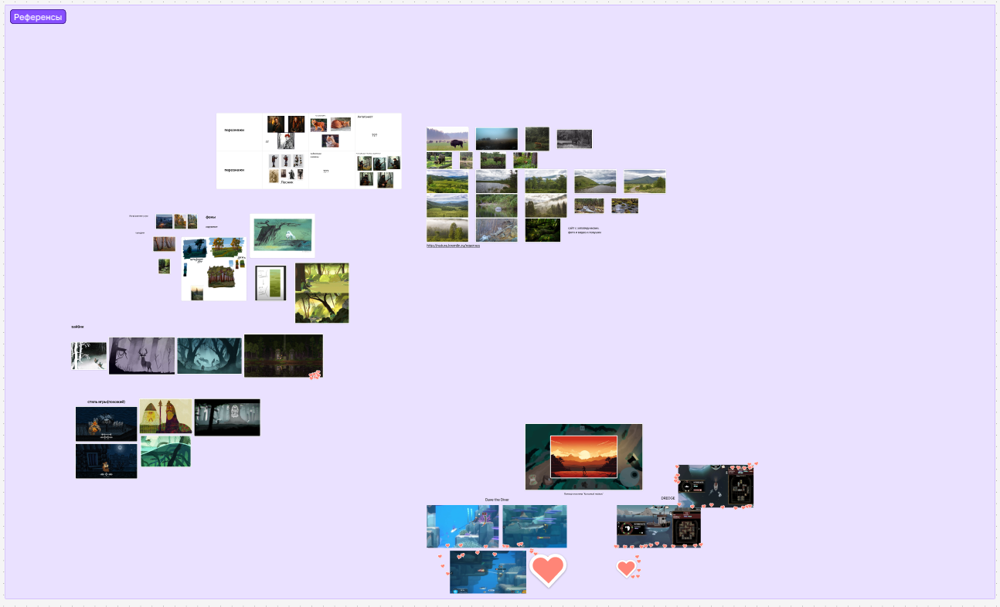

По новой задумке проект стал представлять из себя **top-down с мини-играми** (как пример, лечение животных на территории заповедника) на движке **Unity**.

В этот же момент началась работа над сюжетом.

### Создание артбука с концептами и единой стилистикой

Следующим важным этапом стало создание артбука. По сути этот этап является логичным продолжением предыдущего: компилируя собранные примеры, удалось создать собственные концепты, необходимые для дальнейшего представления о дизайн составляющей.

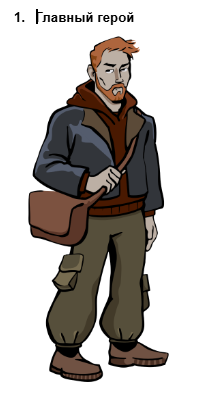

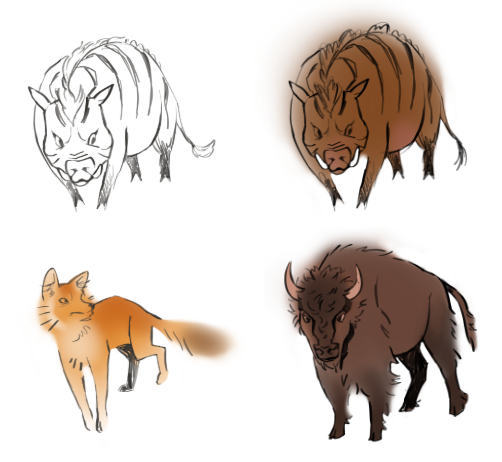

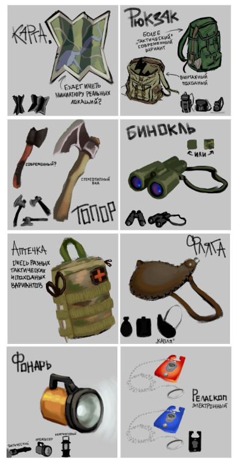

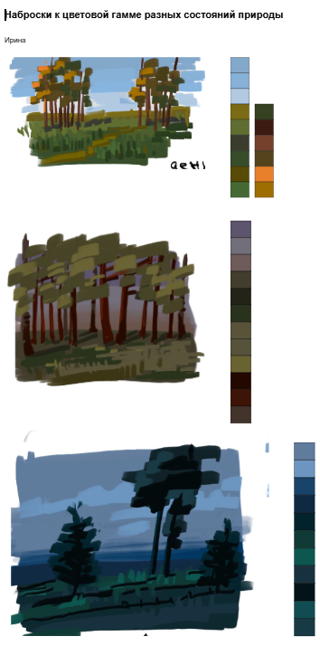

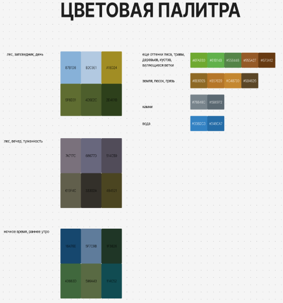

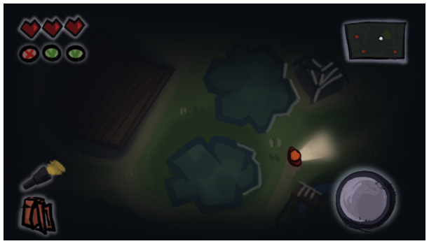

### Разработка раннего билда

Завершением работы над проектом в этом семестре стало создание раннего, но уже играбельного билда. Для него были разработаны тайлы, локации и различные ассеты и написан код.

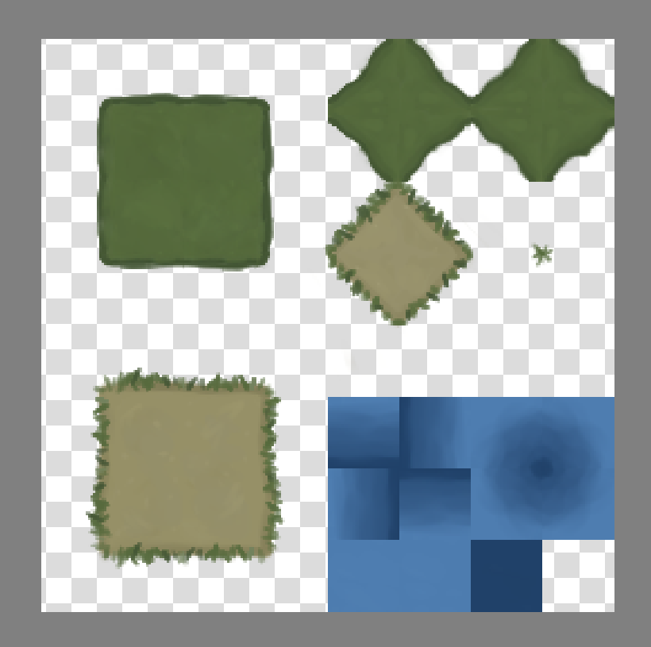

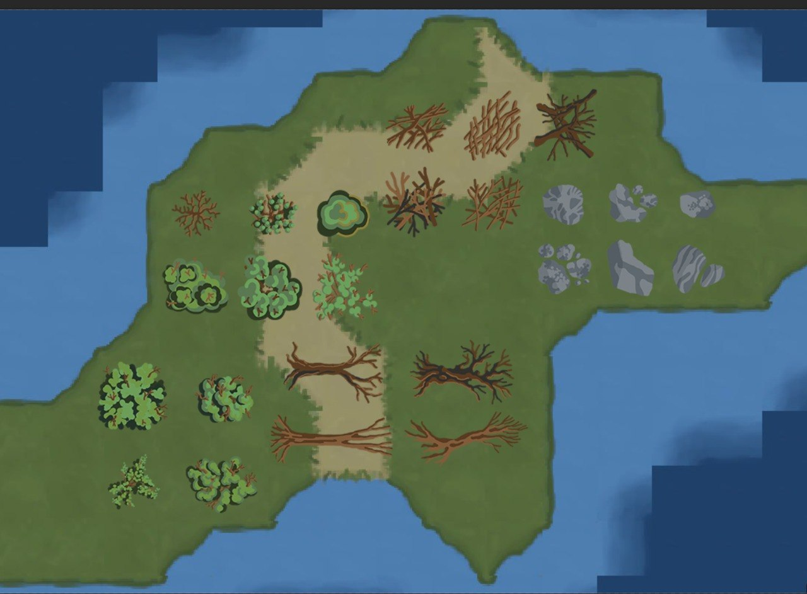

.png)

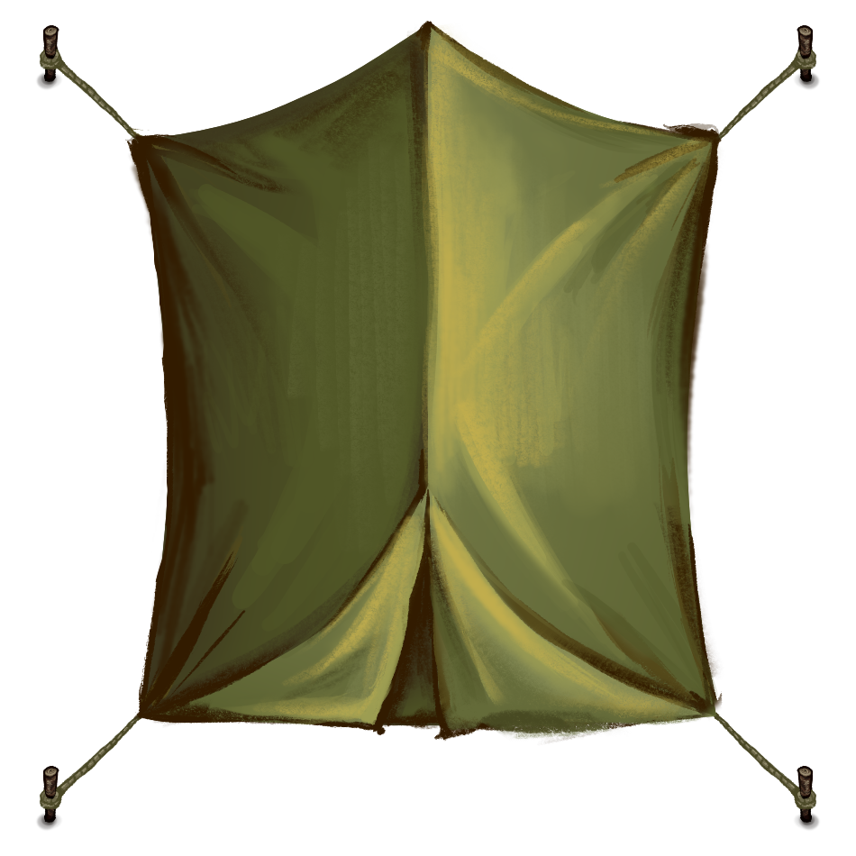

На данный момент скриншот готового билда выглядит так:

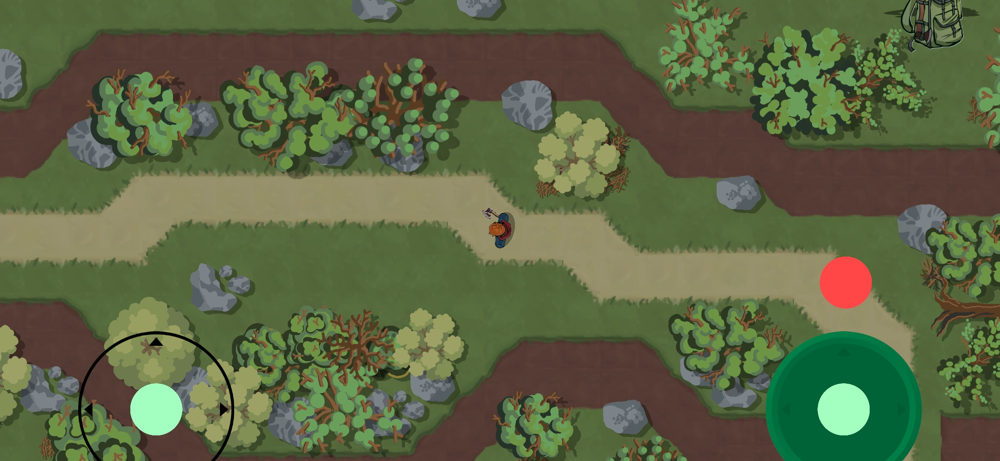

