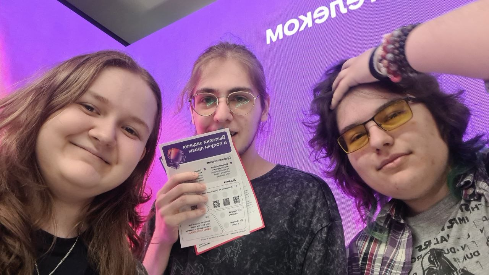
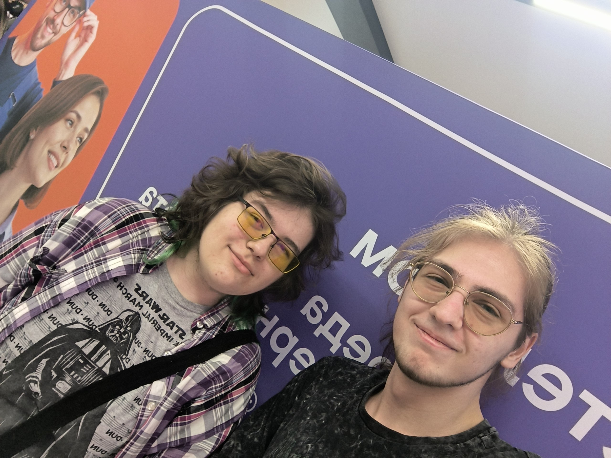
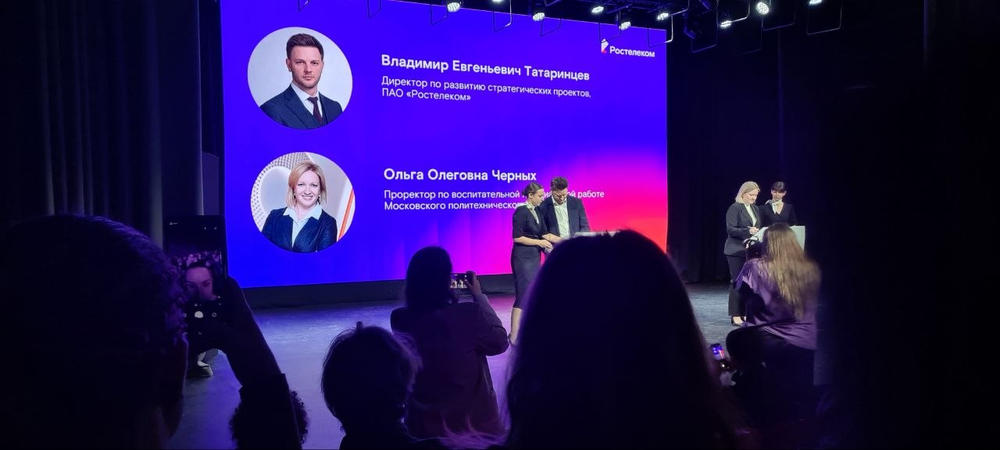
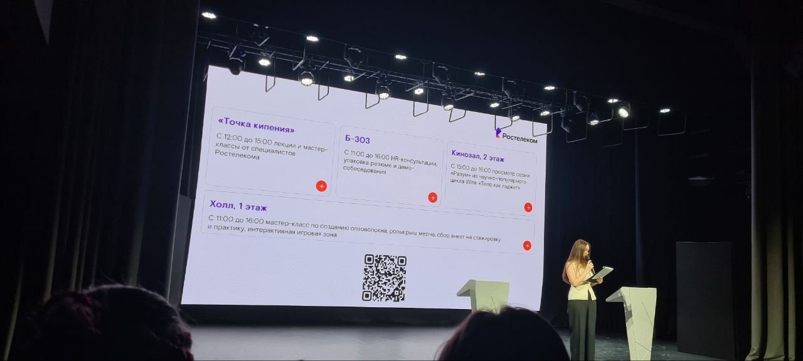

# Отчёт о взаимодействии с организацией-партнёром

---

## Мероприятие: "День Ростелекома"

**Дата проведения:** 07.04.2026

**Место проведения:** Московский Политех, ул. Большая Семёновская, 38 (м. Электрозаводская), блок А 

**Время мероприятия:**  11:00 - 16:00

---

## Цель посещения мероприятия

* Возможность ознакомиться с одним из вероятных будущих работодателей **компанией ПАО «Ростелеком»**

* Изучение современных направлений развития телекоммуникационной и IT-сфер

* Рассмотрение варианта подачи заявок на стажировку

* Способ узнать больше о предлагаемых программах повышения квалификации

---

## Впечатления от мероприятия

Мероприятие было разделено на несколько треков: образовательный, карьерный, развлекательный. Каждый из них предоставлял собственные активности с разной степенью пользы.

### Образовательный трек:

Представлял из себя **лекции и демо-зоны**, благодаря чему можно было получить как теоретические, так и практические знания. Лекции были разнообразными, но полезными, каждая в своей области. Начиная с рассмотрения перспектив дальнейшего трудоустройства студентов в IT, построения карьеры и личного развития, а заканчивая более техническими знаниям об предоставлении интернет-услуг. Полученная информация позволила расширить представление о профессиональной деятельности в сфере информационных технологий и телекоммуникаций.

Выступления были посвящены:

* взаимодействию телекоммуникаций, больших данных и электронной коммерции;
- построению карьеры в крупной IT-компании;
- современным технологиям автоматизации клиентского сервиса;
- особенностям функционирования сети Интернет и межоператорского взаимодействия.

### Карьерный трек:

В рамках трека была предоставлена возможность проконсультироваться с HR-специалистами компании в **"Карьерной гостиной"**, а также **"Начни карьеру в Ростелекоме"**, где можно было по желанию подать заявки на стажировку или практику.

Как участники мы получили полезные рекомендации по составлению своих резюме, прохождению собеседований и построению личного профессионального пути в компании.

Участие в карьерном треке позволило получить актуальную информацию о требованиях работодателей к начинающим неопытным специалистам, востребованных знаниях и возможностях дальнейшего трудоустройства в Ростелекоме.

### Развлекательный трек:

Помимо образовательной части, на мероприятии были **интерактивные зоны, мультимедийные стенды, конкурсы и лотереи**, в которых можно было выиграть уникальный мерч, при выполнении всех условий описанных на отдельных листах. Участникам были представлены стенды с ипользованием ныне крайне актуальных ИИ-технологий, игровые и мультимедийные активности, фотозоны и профессиональные симуляторы.

Эти активности позволили оценить не только актуальное состояние Ростелекома в областях развития ИИ и прочих технологий, но и готовность, форму и избираемые пути взаимодействия со своими потенциальными работниками.

---

## Какие знания мы получили на мероприятии?

В ходе посещения мероприятия были получено множество знаний о современных направлениях развития телекоммуникационной и ИТ-отрасли в России, принципах работы крупной цифровой компании и особенностях организации корпоративных процессов.

Особое внимание было уделено:

- принципам функционирования сети Интернет и межоператорского взаимодействия;
- современным технологиям работы с клиентами;
- использованию больших данных и ИИ-технологий в телекоммуникационной сфере;
- особенностям построения и эксплуатации оптоволоконных сетей связи;
- структуре работы крупной компании и распределению профессиональных ролей;
- требованиям работодателей к молодым специалистам;
- особенностям построения карьеры в сфере информационных технологий и телекоммуникаций.

---

## Выводы

Посещение мероприятия **"День Ростелекома в Московском Политехническом университете"** позволило получить представление о деятельности **ПАО "Ростелеком"** как организации-партнёра университета, а также изучить карьерные и образовательные возможности для студентов.

---

## Фото-пруфы

