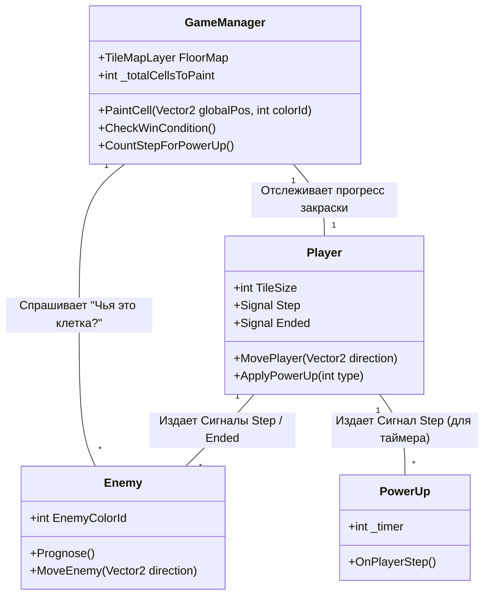
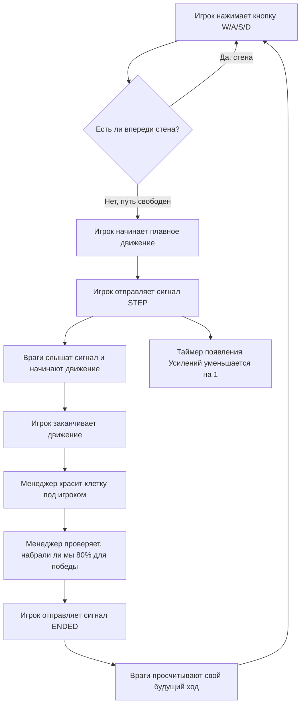

# Техническое руководство по разработке проекта "Brushie"

**Тип:** Практическая реализация технологии (Адаптация "Learn C# by Building a Simple RPG").  
**Стек технологий:** Godot Engine 4.x (Mono/C# версия), C# (.NET).  

---

# 1. Введение

Изначально мы отталкивались от идеи создания классической пошаговой RPG, но в процессе мозгового штурма концепция эволюционировала в тактическую пошаговую головоломку **"Brushie"**.

## Суть игры

Вы играете за персонажа **"Brushie"** — живое пятно краски (синего цвета). Ваша цель — закрасить определенный процент игрового поля.

Против вас играют вражеские пятна (красного цвета), которыми управляет искусственный интеллект. Враги пытаются закрасить ваши клетки и чистый пол в свой цвет. Если враг сталкивается с вами — вы проигрываете.

## Главная фишка

Игра пошаговая.

Вы делаете шаг (нажатием клавиш `WASD` или стрелочек) → враги делают свой шаг.

Если вы стоите на месте, то и враги стоят.

## Почему Godot 4 и C#?

Godot — это современный, бесплатный и очень легкий движок. Он идеально подходит для 2D-игр.

Мы выбрали язык C# вместо стандартного GDScript, так как C# является объектно-ориентированным языком, который более широко используется в индустрии.

---

# 2. Архитектура проекта (UML Диаграммы)

Чтобы игра работала без багов (например, чтобы враг не успел походить дважды, пока игрок идет один раз), используем систему Событий (`Signals`).

Сигнал — это как громкий крик на всю игру:  
> "Я сделал шаг!"

Все, кому это интересно (враги, предметы), слышат этот сигнал и делают свои ответные действия.

## Схема взаимодействия объектов (UML)



## Блок-схема игрового цикла (Один ход)



---

# 3. Подробное руководство для новичков

В этом разделе пошагово описано, как с нуля собрать игру **"Brushie"** в движке Godot 4, даже если вы никогда раньше не программировали.

## Базовые понятия Godot

Прежде чем начать, нужно понять 3 главных термина в Godot:

### 1. Узел (`Node`)
Это отдельная деталька конструктора Lego.

Например:
- картинка на экране — `Sprite2D`
- звук — `AudioStreamPlayer`
- столкновения — `CollisionShape2D`

### 2. Сцена (`Scene`)
Это готовая постройка из деталек Lego (узлов).

Например:
- Игрок — это сцена
- Уровень — это сцена
- Главное меню — это тоже сцена

### 3. Инспектор (`Inspector`)
Панель справа, где можно менять настройки выбранного узла:
- цвет
- текстуру
- размер
- позицию

---

## Шаг 0: Создание проекта

1. Запустите Godot Engine (обязательно версию с поддержкой `.NET/C#`).
2. Нажмите кнопку `New Project`.
3. Назовите проект `Brushie`, выберите пустую папку и нажмите `Create & Edit`.
4. В панели `Scene` выберите `2D Scene`.
5. Godot создаст главный узел `Node2D`.
6. Переименуйте его в `Level1`.

---

## Шаг 1: Создание игрового поля (`TileMapLayer`)

В нашей игре всё поле разбито на квадратные клеточки размером `6x6` пикселей.

1. Нажмите ПКМ по `Level1` → `Add Child Node`.
2. Добавьте узел `TileMapLayer`.
3. В инспекторе найдите свойство `Tile Set`.
4. Нажмите `<empty>` → `New TileSet`.
5. Откройте созданный `TileSet`.
6. Установите `Tile Size`:
   - Width: `6`
   - Height: `6`
7. Перетащите атлас текстур в окно TileSet.

Godot автоматически разрежет изображение на квадраты `6x6`.

### Иллюстрация 1

Настройка сетки `6x6` пикселей в `TileSet`.

---

## Шаг 2: Создание Игрока (`Player`)

Игрок — самостоятельный объект.

### Создание сцены игрока

1. Нажмите `Scene → New Scene`.
2. Выберите `CharacterBody2D`.
3. Назовите узел `Player`.

### Добавление дочерних узлов

Добавьте:
- `AnimatedSprite2D`
- `RayCast2D`

### Подключение скрипта

1. ПКМ по `Player`
2. `Attach Script`
3. Выберите язык `C#`
4. Нажмите `Create`

## Код игрока (`Player.cs`)

```csharp
using Godot;
using System;

public partial class Player : CharacterBody2D
{
    [Export] public int TileSize = 6;

    private bool _isMoving = false;

    [Signal] public delegate void StepEventHandler();
    [Signal] public delegate void EndedEventHandler();

    private RayCast2D _ray;
    private AnimatedSprite2D _sprite;

    public override void _Ready()
    {
        _ray = GetNode<RayCast2D>("RayCast2D");
        _sprite = GetNode<AnimatedSprite2D>("AnimatedSprite2D");
    }

    public override void _Process(double delta)
    {
        if (_isMoving) return;

        Vector2 inputDir = Vector2.Zero;

        if (Input.IsActionPressed("ui_right"))
        {
            inputDir = Vector2.Right;
            _sprite.Play("right");
        }
        else if (Input.IsActionPressed("ui_left"))
        {
            inputDir = Vector2.Left;
            _sprite.Play("left");
        }
        else if (Input.IsActionPressed("ui_up"))
        {
            inputDir = Vector2.Up;
            _sprite.Play("up");
        }
        else if (Input.IsActionPressed("ui_down"))
        {
            inputDir = Vector2.Down;
            _sprite.Play("down");
        }

        if (inputDir != Vector2.Zero)
        {
            MovePlayer(inputDir);
        }
    }

    private void MovePlayer(Vector2 direction)
    {
        _ray.TargetPosition = direction * TileSize;
        _ray.ForceRaycastUpdate();

        if (_ray.IsColliding()) return;

        _isMoving = true;

        EmitSignal(SignalName.Step);

        Vector2 targetPos = Position + (direction * TileSize);

        Tween tween = CreateTween();
        tween.SetTrans(Tween.TransitionType.Sine);
        tween.SetEase(Tween.EaseType.InOut);
        tween.TweenProperty(this, "position", targetPos, 0.1f);

        tween.Finished += OnMoveFinished;
    }

    private void OnMoveFinished()
    {
        _isMoving = false;
        EmitSignal(SignalName.Ended);
    }
}
```

---

## Шаг 3: Создание Врага (`Enemy`)

Враги создаются по аналогичной схеме:

```text
CharacterBody2D
 ├── RayCast2D
 └── AnimatedSprite2D
```

### Иллюстрация 2

Иерархия узлов врага (`Enemy`) на панели сцены.

## Подписка врага на сигналы игрока

```csharp
public override void _Ready()
{
    _player = GetParent().GetNodeOrNull<Player>("Player");
    
    if (_player != null)
    {
        _player.Step += OnPlayerStep;
    }
}

private void OnPlayerStep()
{
    MoveEnemy(_nextDirection);
}
```

## Интеллект врага

Перед ходом враг проверяет все 4 направления через `RayCast2D`.

С помощью `GameManager` он анализирует цвет клеток вокруг.

### Приоритеты ИИ

1. Розовые клетки игрока
2. Серый чистый пол
3. Красные клетки врага (если других вариантов нет)

---

## Шаг 4: Игровой менеджер (`GameManager`)

Менеджер игры — управляющий узел (`Node`), который:
- следит за правилами игры
- красит тайлы
- вычисляет прогресс игрока

## Метод перекрашивания клетки

```csharp
public void PaintCell(Vector2 globalPos, int colorId)
{
    if (FloorMap == null) return;

    Vector2I cellCoords = FloorMap.LocalToMap(FloorMap.ToLocal(globalPos));

    Vector2I atlasCoord = _enemyCoords;

    if (colorId == 0) atlasCoord = _playerCoords;
    if (colorId == 2) atlasCoord = _goldCoords;

    FloorMap.SetCell(cellCoords, 0, atlasCoord);

    CheckWinCondition();
}
```

---

# 4. Усиления

Чтобы сделать геймплей динамичнее, мы разработали систему Усилений.

После каждых 10 шагов игрока на карте появляется случайное усиление.

## Логика усилений

Усиление является узлом `Area2D`.

```csharp
public void _on_body_entered(Node2D body)
{
    if (_timer == 0 && body is Player p)
    {
        p.ApplyPowerUp(_type);
        QueueFree();
    }
}
```

## Типы усилений

### 1. AoE-краска
Игрок красит область `3x3` вокруг себя.

Длительность: `5 ходов`.

### 2. Золотая краска
Игрок оставляет золотые клетки.

Враги считают их стенами.

Длительность: `7 ходов`.

### 3. Заморозка
Все враги перестают двигаться.

Длительность: `5 ходов`.

### Иллюстрация 3

Появление коробочки усиления на игровом поле.

---

# 5. Хронология и финальный отчёт

## Хронология работ

| Этап | Выполненные задачи |
|---|---|
| Этап 1: Исследование | Выбор идеи. Анализ механики пошаговости. |
| Этап 2: Прототипирование | Создание сцен. Пиксель-арт 6x6. Настройка коллизий и `RayCast2D`. |
| Этап 3: C# Логика | Перенос логики на C#. Создание `Player.cs`. |
| Этап 4: Написание ИИ | Разработка `Enemy.cs` и логики поведения врагов. |
| Этап 5: Усиления | Реализация системы `PowerUp.cs` и трех типов усилений. |
| Этап 6: Полировка и UI | Создание меню, интерфейса и документации. |

---

# Индивидуальные планы участников

## Опарин Георгий

Отвечал за:
- Программирование логики ИИ
- Инструктирование в Годоте
- логику пошагового движения

## Тишина Кира

Отвечала за:
- Визуальную часть
- Спрайты (пиксель арт)
- Документация

## Баляева Марьяна

Отвечал за:
- Визуальную часть
- Навигация в UI
- Левел дизайн
